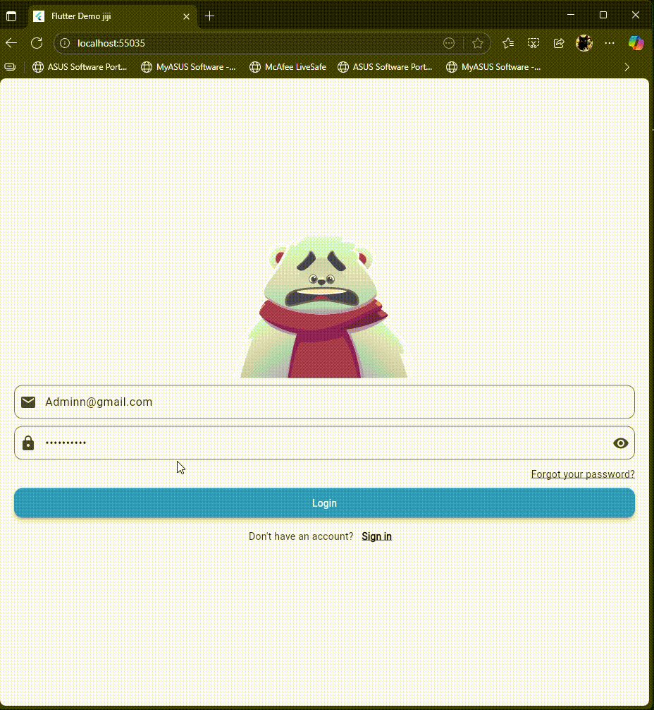

# 🐻 Animated Bear Login

Welcome to the **Animated Bear Login** project! This is an **interactive Flutter login screen** with a cute bear character that reacts to your input.  

---

## ✨ Features

- 👀 **Eye-tracking:** The bear follows your email input with its eyes.  
- 🙈 **Privacy mode:** The bear covers its eyes when typing the password.  
- 😄 **Happy bear:** Appears when login credentials are correct (`Admin@gmail.com` / `Admin12345`).  
- 😢 **Sad bear:** Appears when login credentials are incorrect.  
- 🎨 Smooth animations powered by **Rive**.  

---

## 🛠️ Requirements

- Flutter 3.x or higher  
- Dart 3.x  
- Rive package:

```yaml
dependencies:
  flutter:
    sdk: flutter
  rive: ^0.10.0
```
Rive animation file: assets/animated_login_character.riv with state machine Login Machine.

🚀 Installation

1- Clone the repository:
```
git clone <your_project_url>
```
2- Navigate to the project folder:
```
cd flutter_application_1
```
3- Install dependencies:
```
flutter pub get
```
4- Run the project:
```
flutter run
```
🎮 Usage
#

Enter your email

The bear will follow your typing with its eyes.

Enter your password

The bear automatically covers its eyes.

Press Login

✅ Correct credentials (Admin@gmail.com / Admin12345) → Bear becomes happy

❌ Wrong credentials → Bear becomes sad
#
📂 Project Structure
```
lib/
 ├─ main.dart            # Entry point
 ├─ login_screen.dart    # Login screen with Rive animations
assets/
 └─ animated_login_character.riv   # Bear animation file
pubspec.yaml             # Dependencies and Flutter configuration

```
#
🎨 DEMO: 
#

#
Rive animation used in this project: https://rive.app/marketplace/3645-7621-remix-of-login-machine/ 
